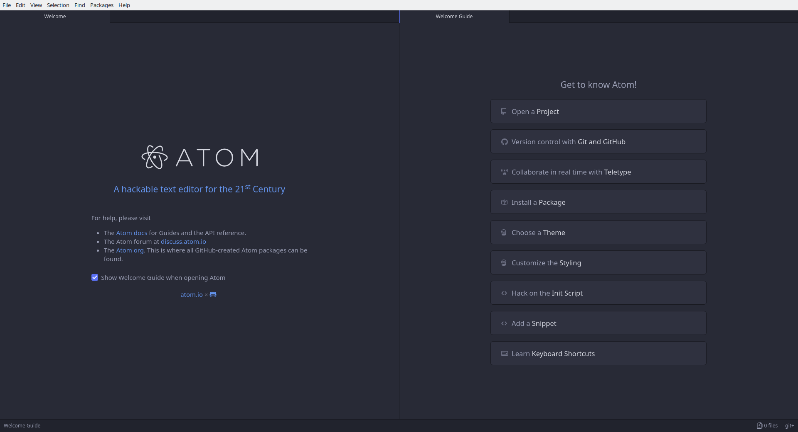
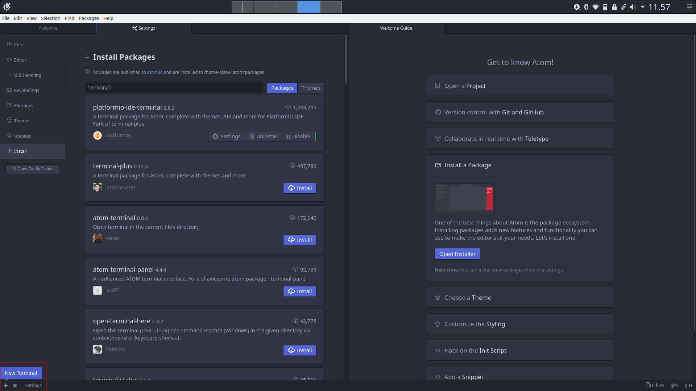
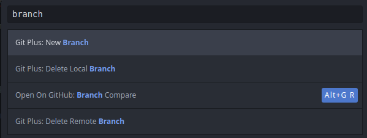
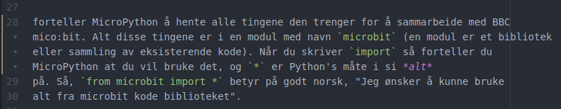
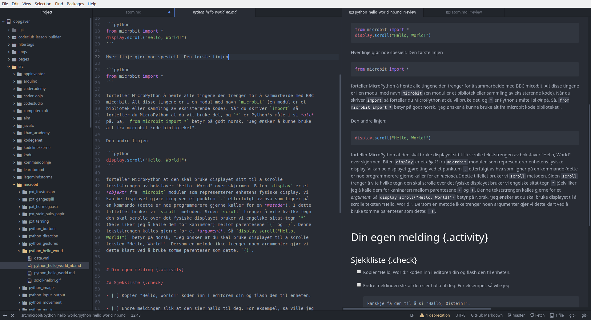
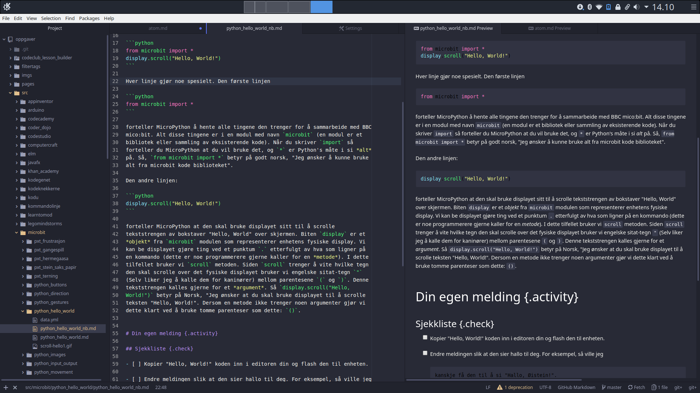

# Introduksjon

Kanskje den beste editoren for å begynne skrive oppgaver er nettopp Atom. Noen
av fordelene er at det er svært enkelt å skreddersy Atom akkuratt slik du vil ha
det. Den tilbyr og svært god interaksjon med Git og ikke minst Markdown. Om dette virker noe skremmende Atom er heldigvis overraskende enkelt å bruke!

## Installasjon

### Windows

Naviger deg seg til [Atom's hjemmeside](https://atom.io/) her vil du med en gang få opp en lenke du kan trykke på for å laste ned programmet.

### Linux

**Ubuntu:** Først må vi skaffe Atom's installasjonsfiler. Her kan du enten
navigere deg til [Atom's kodelager på
git](https://github.com/atom/atom/releases/tag/v1.28.0) og laste ned
`atom-amd64.deb` DEB pakken. Alternativt er det nok like greit å bruke `wget` i
terminalen til å hente nyeste versjon:

    $ wget -O atom-amd64.deb https://atom.io/download/deb

Den enkleste måten å installere DEB filer er ved å installere `gdebi` kommandoen

    sudo apt install gdebi-core

Filen kan nå installeres ved å kjøre

    sudo gdebi atom-amd64.deb

Deretter er det bare å kjøre

    atom

enten fra terminalen eller startmenyen.

**Fedora:** Her er installasjonen litt enklere her laster du ned RPM versjonen
fra [Atom's kodelager på git](https://github.com/atom/atom/releases/tag/v1.28.0). Deretter installerer du den ved å bruke kommandoen

    sudo dnf install ./atom.x86_64.rpm

**Arch Linux:** Atom ligger i AUR så bare bruk den AUR-hjelperen du vil, for
eksempel

    yaourt -S atom

## Grunnleggende bruk

Når du først åpner Atom for første gang vild et se ut noe som det her

Her har du to faner med en rekke nyttige knapper til høyre. Det går helt fint å bruke Atom uten å måtte lære seg noen rare hurtigtaster. Likevell er det en hurtigtast jeg anbefaler deg på det sterkste å bli kjent med og det er følgende

    ctrl - shift - p

Denne hurtigstasten åpnet opp `Atom's Palette` og i denne menyen kan du søke etter bokstavlig alt som finnes i Atom. Dersom du lurer på hvordan noe gjøres i Atom bør føste steget alltid være å søke i denne menyen.

## Installasjon av pakker

Det første vi trenger er å installere _git_ pakken og en enkel _terminal_. Ved å trykke på "Install a package" i bildet ovenfor åpnef følgende meny seg:

Ved å trykke på "Open installer" kan vi installere de pakkene som trengs. Alternativt kunne vi og ha brukt hurtigtasten

    ctrl - ,

for å navigere oss direkte til innstillinger. Alternativt kan en og åpne Atoms hurtigsøk via `ctrl - shift - p` og deretter søke etter `packages`. Pakkene vi trenger er følgende:

Å bruke terminalen er så enkelt som å trykke på `+` ikonet som nå befinner seg nede i venstre hjørnet:

### Vårt første prosjekt

Vi er nå klare til å åpne vårt første prosjekt. Har du husket å opprette en fork av kodeklubbens oppgavesammling? Hvis ikke så kan du lese raskt over dette i introduksjonen til git SETT INN LENKE HER.

I dette steget skal vi se på hvordan vi kan laste ned (vi kaller gjerne dette
for å clone) forken din. Dersom du allerede har gjort dette kan du trygt hoppe
til neste steg. Det finnes flere måter å gjøre dette på innsiden av Atom.

Enten kan vi igjen bruke hurtigmenyen `ctrl - shift - p` også søke etter `clone`. Da vil du få opp følgende meny

Hvor du bytter ut BRUKERNAVN med brukernavnet ditt på GitHub. Du kan selvsagt forandre på hvilken mappe som du skal kopiere prosjektet til ovenfor. Alternativt kan vi og bruke terminalen vi nettopp installerte til dette

Som vi husker vi kunne åpne ved å trykke på `+` symbolet i nedre venstre hjørnet eller `ctrl - ``. Merk at om du ønsker å endre hvilken mappet prosjektet klones til må du først navigere deg til riktig mappe med å bruke `cd MAPPEPLASSERING`.

Obs! Det kan være du får noen feilmeldinger enten at du ikke har riktige rettigheter eller at du ikke har valgt git brukernavn og epost. For å løse disse problemene henviser jeg igjen til Introduksjonen til git.

Nå som vi har klart å laste ned kodeklubbens oppgavesammling kan vi åpne mappen som ett nytt prosjekt. Her kan vi enten søke etter `Project` i kodeklubbens nettside, trykke på `Open Project` i menyen til høyre. Eller velge `Add Project Folder` fra `fil` menyen.

Her er et bilde av at jeg har funnet frem en fil jeg ønsker å jobbe med i Prosjektet.
En veldig grei hurtigtast er

    ctrl - t

Denne gjør at vi kan søke igjennom prosjektet vårt etter relevante filer, i stedet for å navigere oss igjennom mappehirarkiet til høyre. Nå som jeg har åpnet filen min så kan jeg vise hvordan Markdown filen min ser ut i sanntid ved å bruke

    ctrl - shift - m

Da får jeg opp fanen til høyre på bildet ovenfor. Før jeg gjør noen endringer burde jeg bytte til en ny `branch` eller gren, slik at prosjektet blir mer oversiktlig. Igjen så kan dette gjøres enkelt fra hurtigmenyen

eller ved å åpne terminalen med `ctrl `` å skrive

    git checkout -b NAVN_PÅ_NY_BRANCH

Hvilken gren jeg er på kan en alltid se ned i høyre hjørnet i Atom. Når en er ferdig med å jobbe er det på tide å lagre arbeidet sitt, samt å laste det opp til sin egen gren. Her liker jeg godt å bruke github fanen som kan åpnes via

ctrl - shift - 9

I hurtigmenyen kan denne finnes ved å for eksempel søke etter "gtihub tab". Igjen så kan en og utelukkende bruke terminalen, men det blir en smakssak.

## Noen tips og triks

Den vanlige konvensjonen når en koder og som LKK også bruker er at hver linje maksimalt skal være 80 tegn. Dette gjør at utformingen av koden blir mer uniform når en har mange bidragsytere, men og at koden er mer lesbar. Den vertikale streken du ser når du skriver kode er nettopp satt til 80 tegn, slik at du alltid ved hvilke linjer som er for lange. På bildet under ser du at linje 28 strekker seg over 3 linjer, og dette forteller Atom deg ved å legge inn oransje tekst til høyre.

Heldigvis har Atom en pakke kalt `autoflow`. Det eneste formålet til denne
pakken er å bryte lange linjer, og den er installert som standard, flaks! For å
formatere en lang paragraf er det nok å være inne i paragrafen og bruke

  ctrl - shift - q

### Utseende

Det er og fullt mulig å endre utseende til Atom ved å laste ned nye temaer, eller bruke noen av de som ligger inne fra før. For å endre tema kan vi enten søke etter `themes` i hurtigmenyen eller direkte bruke `ctrl ,` for å hoppe til innstillinger. Menyen ser slik ut

**UI:** _Perfect Dark_, **Syntax:** _Perfect Dark_

**UI:** _Perfect Dark_, **Syntax:** _Solarized Dark_

Det er og mulig å laste ned egne temaer fra nettet som vist under.

**UI:** _Perfect Dark_, **Syntax:** _Dracula_

