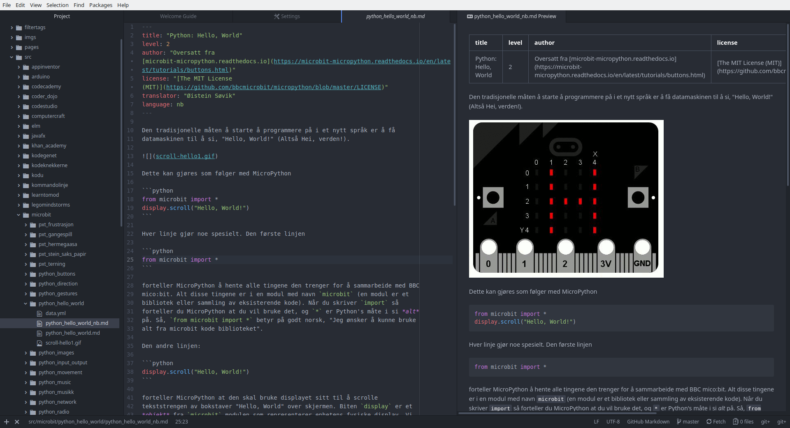

# Introduksjon

Kanskje den beste editoren for å begynne skrive oppgaver er nettopp Atom. Noen
av fordelene er at det er svært enkelt å skreddersy Atom akkuratt slik du vil ha
det. Den tilbyr og svært god interaksjon med Git og ikke minst Markdown.

